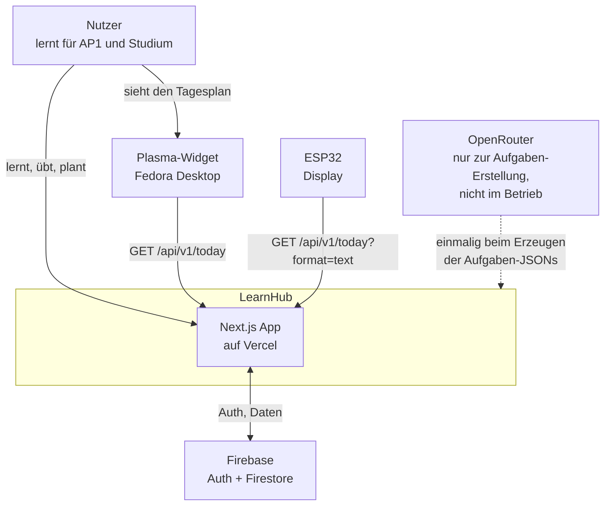
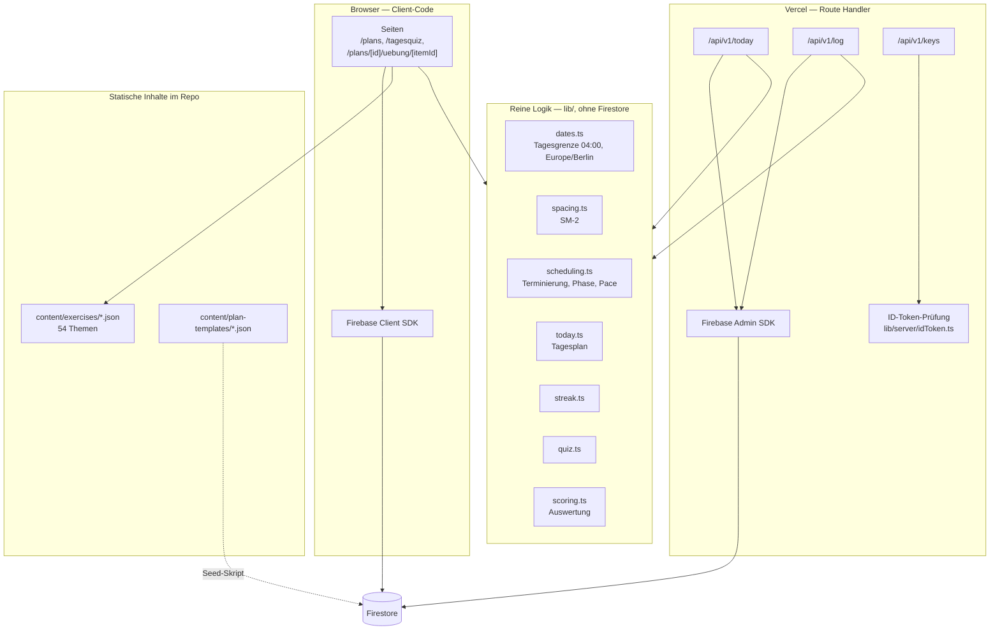
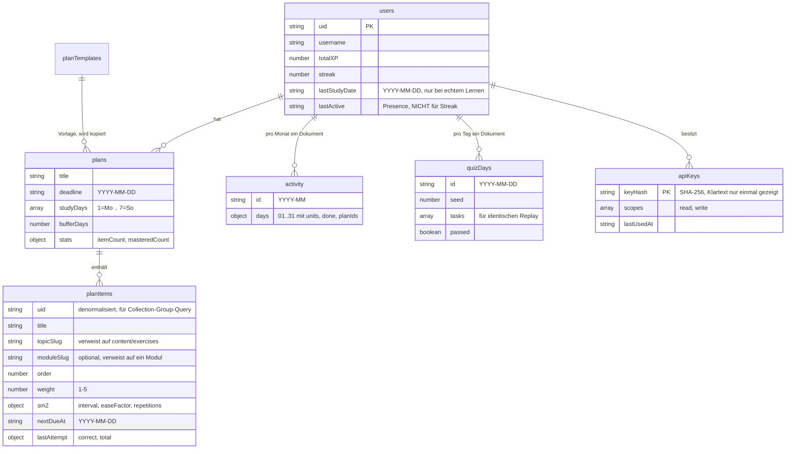
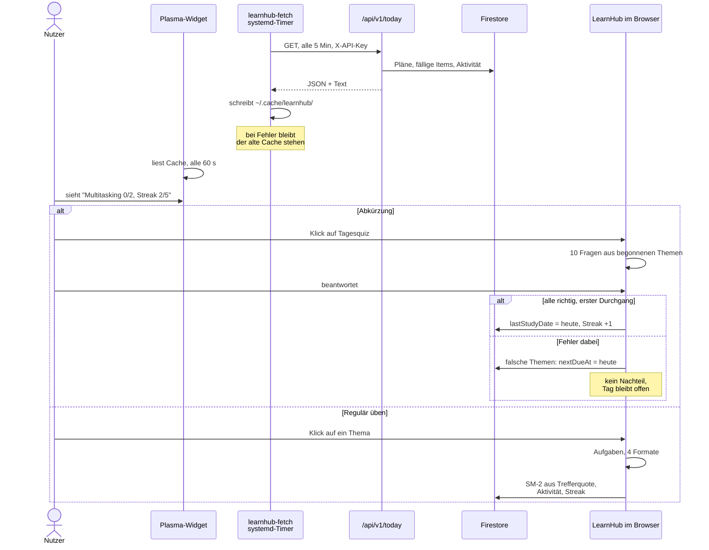
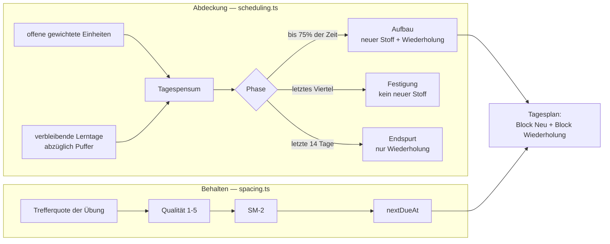

# Architektur

LearnHub ist eine Lernplattform mit terminierten Lehrplänen, Übungsaufgaben und
Spaced Repetition. Externe Clients — ein ESP32-Display und ein KDE-Plasma-Widget
— zeigen den Tagesplan an.

Dieses Dokument beschreibt, wie die Teile zusammenhängen. Die Diagramme sind
Mermaid und werden von GitHub direkt gerendert.

---

## 1. Kontext

Wer und was mit dem System spricht.

**Wichtig:** OpenRouter ist gestrichelt, weil es nur beim Erzeugen der
Übungsaufgaben benutzt wird. Die laufende Anwendung braucht kein Sprachmodell —
die Aufgaben liegen als geprüfte JSON-Dateien im Repo.

---

## 2. Bausteine

Die reine Logik in `lib/` kennt kein Firestore. Deshalb kann sie sowohl im
Browser (Client SDK) als auch in den Route Handlern (Admin SDK) benutzt werden,
und sie ist mit Vitest testbar — über 1200 Tests hängen daran.

---

## 3. Datenmodell

Drei Entwurfsentscheidungen, die dahinterstehen:

**Aktivität als ein Dokument pro Monat**, nicht pro Tag. Firestore rechnet pro
gelesenem Dokument ab; ein Streak über zwei Monate kostet so 2 Reads statt 60 —
relevant, weil das Widget alle 5 Minuten fragt.

**`uid` denormalisiert in `planItems`**, damit eine Collection-Group-Query alle
fälligen Themen über alle Pläne in einem Read holt. Braucht einen Composite-Index
und eine Regel auf Gruppenebene, weil verschachtelte Regeln dort nicht greifen.

**`lastStudyDate` getrennt von `lastActive`.** Der Streak hing ursprünglich an
`lastActive`, das der Presence-Heartbeat alle 20 Sekunden neu stempelt — er maß
also "Tab offen", nicht "gelernt".

---

## 4. Der Tagesablauf

---

## 5. Die Lernlogik

Zwei Dinge werden getrennt gerechnet: **Abdeckung** (schaffe ich den Stoff bis
zur Prüfung) und **Behalten** (kann ich es am Prüfungstag noch).

Überfällige Wiederholungen haben Vorrang vor neuem Stoff — sonst wächst ein
Berg, der nie abgebaut wird.

Ein Thema gilt nicht als erledigt, wenn es abgehakt wurde, sondern erst wenn
`isConsolidated` greift (mehrfach mit Abstand korrekt). Der Fortschrittsbalken
zählt danach, nicht nach bearbeiteten Einheiten.

---

## 6. Wo liegt was

| Datei | Zuständig für |
|---|---|
| `lib/dates.ts` | Tagesgrenze 04:00, Europe/Berlin, DST-sicher |
| `lib/spacing.ts` | SM-2, geteilt mit den Karteikarten |
| `lib/scheduling.ts` | Terminierung, Phase, Pace, `isConsolidated` |
| `lib/today.ts` | Tagesplan aus beiden Blöcken, Wochenfortschritt |
| `lib/streak.ts` | Streak aus `lastStudyDate`, freie Tage |
| `lib/quiz.ts` | Zusammenstellung und Auswertung des Tagesquiz |
| `lib/exercises/` | Aufgaben-Registry, prozedurale Generatoren, Scoring |
| `lib/plans.ts` | Firestore-Zugriffe für Pläne (Client SDK) |
| `lib/planReview.ts` | Reine Berechnung eines Review-Ergebnisses |
| `lib/server/` | Admin-SDK-Pfade, ID-Token-Prüfung, Tagesdaten für die API |
| `lib/apiText.ts` | 40-Spalten-Textformat für ESP32 und Widget |
| `lib/answerCheck.ts` | Freitext-Antwortvalidierung (Mengen, Toleranz, *↔·) |
| `lib/array.ts`, `lib/format.ts`, `lib/rarity.ts` | Geteilte Mini-Helfer (Shuffle, Zahlenformat, Seltenheiten) |
| `lib/calculator.ts` | Taschenrechner-Auswertung (Lern-Clicker, reine Funktion) |
| `lib/skillTreeLayout.ts` | Deterministisches Graph-Layout der Skill-Tree-Graph-Ansicht |
| `lib/lessonHelpers.ts` | Fabrik für die Standard-Aufgabenlektionen (leicht/mittel/schwer/Prüfung) |
| `components/MarkdownContent.tsx` | Geteilter Renderer für Lektions- und Merkblatt-Content |
| `components/clicker/` | Werkzeug-Panels des Lern-Clickers (Rechner, Notizfläche) |
| `scripts/` | Seeds, Backfills, Aufgaben-Generator, LaTeX-Validierung/Fixes |

---

## 7. Getroffene Entscheidungen

| Entscheidung | Warum |
|---|---|
| Aufgaben als statische JSONs im Repo, nicht generiert zur Laufzeit | Kostenlos, offline, geprüft. Ein Sprachmodell soll keinen ungeprüften Prüfungsstoff ausliefern. |
| Subnetting, Zahlensysteme und Wirtschaftsrechnen prozedural erzeugt | Unbegrenzt viele Aufgaben mit garantiert korrekter Lösung. Genau dort verrechnen sich Sprachmodelle. |
| Trefferquote steuert SM-2, nicht Selbsteinschätzung | Man hält sich für sicherer, als man ist — genau das soll das System aufdecken. |
| Quiz kann SM-2 nur verschlechtern, nie verbessern | Sonst schiebt man die echte Wiederholung mit je einer richtigen Antwort dauerhaft vor sich her. |
| Ein Streak, nicht zwei | Zwei Zahlen, die unterschiedliche Werte zeigen, sind schlimmer als eine ungenaue. |
| Widget liest Cache-Datei, nie direkt das Netz | Ohne Verbindung bleibt der letzte Stand sichtbar statt einer leeren Fläche. Der API-Key bleibt im Skript. |
| ID-Token-Prüfung ohne `firebase-admin/auth` | Dessen Abhängigkeit `jwks-rsa` bricht auf Vercel mit `ERR_REQUIRE_ESM`. Prüfung direkt mit `jose` gegen Googles JWKS. |
| Clicker-Werkzeuge (Rechner, Skizzen) nur lokal gespeichert | Kein Firestore-Schema, keine Rules für Nebenbei-Tools — Skizzen sind Wegwerf-Notizen, kein Lernfortschritt. |

---

## 8. Datenorganisation & Ausblick

LearnHub wächst — die Richtung für die Organisation von Inhalten:

**Ein Registry pro Content-Typ, Content als Daten statt Code.**
- **Übungsaufgaben** liegen als geprüfte JSONs in `content/exercises/` und werden
  über `lib/exercises/registry.ts` (topicSlug → Datei) geladen. Das ist das
  Zielformat — auch für die Modul-Aufgabenpools, die heute noch in
  `lib/mathExercises.ts` stehen (siehe Migration unten).
- **Module & Lektionen** sind Code (`lib/*Data.ts` → `lib/data.ts`), weil sie
  interaktive Komponenten, Typen und Verweise brauchen. Eine JSON-Fassung würde
  den Teil mit dem höchsten Änderungstempo (Texte, Übungen) nicht entkoppeln,
  sondern doppelte Pflege erzeugen.
- **Skill-Tree-Struktur** (`lib/skillTree.ts`: Knoten, Voraussetzungen, Etagen)
  bleibt die einzige Quelle für Abhängigkeiten — beide Skill-Tree-Ansichten
  (Etagen + Graph) beziehen sich daraus. Status kommt ausschließlich aus den
  bestehenden Fortschrittsdaten (`completedModules`, `completedLessons`).

**Regeln für Neues:**
1. Neuer Content-Typ → eigenes JSON-Verzeichnis + Registry-Datei, nie eine
   weitere `*Data.ts`-Kopie eines bestehenden Musters.
2. Gleiche Logik (Scoring, Shuffle, Format, Antwortvalidierung) → `lib/`-
   Modul, keine lokale Kopie in Komponenten.
3. Lesson-IDs sind Nutzer-Fortschritts-Keys — nie umbenennen, sonst geht
   Fortschritt verloren (deshalb erzeugt `createExerciseLessons` IDs über
   den optionalen `lessonIdPrefix`).

**Offene Migration (bewusst noch nicht umgesetzt):** Die Modul-Aufgabenpools
(31 Module in `lib/mathExercises.ts` + die `*Data.ts`-Pools) auf das
JSON/Registry-System heben. Werkzeuge dafür existieren bereits
(`lib/exercises/convertMath.ts`, `scripts/convert-math-exercises.ts`,
`tests/convertMath.test.ts`). Voraussetzung: Type-Mapping `input|multiple` →
`recall|numeric|choice`, Prüfmodus und Difficulty-Filter bleiben
verhaltensgleich, danach Smoke-Test über alle 31 Module.